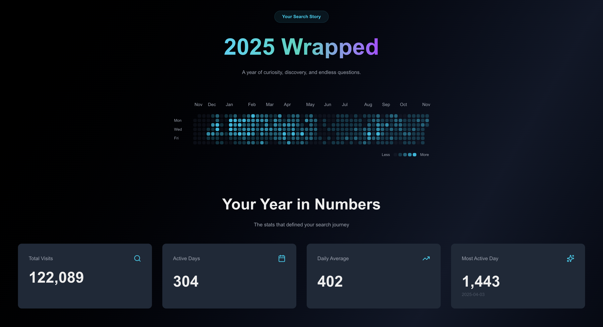

# 🖥️ Browser History Wrapped | 1 year

A beautiful, privacy-focused web application that transforms your Chrome browsing history into an interactive year-in-review experience, inspired by Spotify Wrapped.



## ✨ Features

- 📊 **Interactive Statistics Dashboard**
  - Total visits count
  - Active browsing days
  - Daily average activity
  - Most active day with date

- 🔥 **Activity Heatmap**
  - GitHub-style contribution graph
  - Hover tooltips showing daily visit counts

- 🔍 **Top Searches**
  - Discover your most frequent search queries
  - See what topics dominated your year

- 🔗 **Shareable Results**
  - Generate a unique URL to share your stats
  - URL-encoded data (no server storage required)

- 🔒 **100% Private**
  - All processing happens in your browser
  - No data uploaded to any server
  - Your browsing history never leaves your device

## 🚀 Live Demo

Check out the live demo: https://marianaes.github.io/chrome-searches-wrapper/

## 🛠️ Tech Stack

- **Framework:** [Next.js 14](https://nextjs.org/) (App Router)
- **Language:** TypeScript
- **Styling:** Tailwind CSS
- **Icons:** Lucide React
- **Deployment:** Vercel (or your deployment platform)

## 📦 Installation

1. **Clone the repository:**

```bash
   git clone https://github.com/yourusername/browser-history-wrapped.git
   cd browser-history-wrapped
```

2. **Install dependencies:**

```bash
   npm install
   # or
   yarn install
   # or
   pnpm install
```

3. **Run the development server:**

```bash
   npm run dev
   # or
   yarn dev
   # or
   pnpm dev
```

4. **Open your browser:**
   Navigate to [http://localhost:3000](http://localhost:3000)

## 📖 How to Use

### Step 1: Export Your Chrome History

1. Go to [Google Takeout](https://takeout.google.com)
2. Click "Deselect all"
3. Scroll down and select only "Chrome"
4. Click "All Chrome data included" and deselect everything except "History"
5. Click "Next step" and create the export
6. Wait for the email from Google (can take a few hours)
7. Download and extract the ZIP file
8. Find `Takeout/Chrome/History.json`

### Step 2: Upload and Visualize

1. Visit the app
2. Upload your `History.json` file
3. Explore your browsing statistics!
4. Share your results with friends

## 🔐 Privacy & Security

- **Client-side processing:** All data processing happens in your browser using JavaScript
- **No server uploads:** Your browsing history is never sent to any server
- **No tracking:** We don't use analytics or tracking cookies
- **Open source:** All code is public and auditable
- **Shareable links:** Only contain aggregated statistics, not raw browsing data

---

⭐ If you found this project interesting, please consider giving it a star!

Made with ❤️ and lots of ☕
